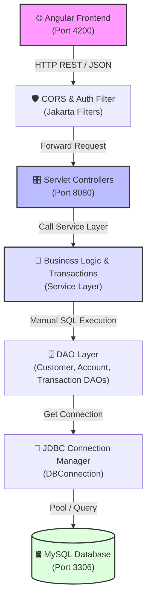

# 🏦 Full-Stack Bank Management System

[](https://openjdk.org/)
[](https://angular.dev/)
[](https://www.eclipse.org/jetty/)
[](https://maven.apache.org/)
[](https://www.mysql.com/)

A secure, high-performance, full-stack digital banking web application. It features a modern, standalone **Angular 17 frontend** and a lightweight, custom **Jakarta Servlet API backend** built completely from the ground up using **Core Java** and **raw JDBC** (no Spring, Hibernate, or external ORM frameworks).

This project highlights core Java developer capabilities, custom runtime testing, manual connection and transaction management, validation pipelines, and RESTful API engineering.

---

## 📖 Table of Contents

1. [Architecture Diagram](#-1-architecture-diagram)
2. [Key Technical Highlights](#-2-key-technical-highlights)
3. [Technology Stack](#-3-technology-stack)
4. [Project Structure](#-4-project-structure)
5. [Database Schema & ER Design](#-5-database-schema--er-design)
6. [REST API Documentation](#-6-rest-api-documentation)
7. [Getting Started & Local Setup](#-7-getting-started--local-setup)
8. [Advanced Core Concepts Demonstrated](#-8-advanced-core-concepts-demonstrated)
9. [License](#-9-license)

---

## 🏗️ 1. Architecture Diagram

The application implements a clean, decoupled **Multi-Tier Architecture** that enforces structural separation of concerns.



---

## 🌟 2. Key Technical Highlights

*   **Zero Spring/ORM Overhead:** The backend is built without heavy framework dependencies like Spring Boot, JPA, or Hibernate. All routing, filtering, database bindings, and transaction boundaries are written in pure Core Java.
*   **Manual ACID JDBC Transactions:** To ensure financial integrity, fund transfers are explicitly managed at the database connection level. Uses `connection.setAutoCommit(false)`, handles custom validation checks, updates both accounts, writes audit records, and calls `connection.commit()`. It executes a `connection.rollback()` automatically if any database or application error occurs.
*   **Mock-Free JVM Dynamic Proxy Testing:** Rather than relying on external libraries like Mockito, the JUnit 5 test suite utilizes standard Java reflection (`java.lang.reflect.Proxy`) to dynamically intercept `java.sql.Connection` operations. This allows testing of exact transaction commitments and rollbacks in memory.
*   **Polymorphic Bank Rules:** Includes abstract models representing `Account`, which subclass into `SavingsAccount` and `CurrentAccount`. Custom withdrawal limits, minimum balance checks, and overdraft validation are computed polymorphically using subclass-specific rules.
*   **State-of-the-Art Angular 17 UI:** Modern UX incorporating Angular standalone components, Material Design library, forms validation, route guards, and Bearer token request interceptors.

---

## 💻 3. Technology Stack

### Frontend Client
*   **Core framework:** Angular 17 (Standalone architecture)
*   **Programming Language:** TypeScript
*   **Styling & UI Library:** Vanilla CSS3 + Angular Material Design components
*   **Client communication:** Angular `HttpClient` + HTTP Bearer Interceptors
*   **Routing & Access Control:** Angular Router + Route Guards (`auth.guard.ts`)

### Backend Server
*   **Language runtime:** Java 17+ (JDK 23 verified)
*   **Servlet Engine:** Embedded Eclipse Jetty Server (v11.x - Jakarta namespace)
*   **Controller / Route Routing:** Jakarta Servlets 5.0
*   **Data Serialization:** Google Gson (with custom adapters for Java date types)
*   **Security & Hashing:** BCrypt hashing (`org.mindrot:jbcrypt`)
*   **Build Tooling:** Apache Maven 3.8+

### Database Layer
*   **Database Engine:** MySQL Server 8.0
*   **Database Connectivity:** Java Database Connectivity (JDBC)
*   **Driver:** MySQL Connector/J (`mysql-connector-java`)

---

## 📂 4. Project Structure

```text
bank-management-system/
├── backend/
│   ├── pom.xml                                   # Maven dependencies & plugins
│   └── src/
│       ├── main/java/com/bankmanagement/
│       │   ├── App.java                          # Embedded Jetty Web Server entry-point
│       │   ├── DatabaseSeeder.java               # Automated SQL Schema & Seed Database Populator
│       │   ├── config/
│       │   │   └── AppConfig.java                # System configuration & DB parameters
│       │   ├── controller/                       # Controllers & Intercepting Filters
│       │   │   ├── BaseController.java           # Base class containing JSON helper operations
│       │   │   ├── AuthController.java           # Login & Logout Servlet
│       │   │   ├── CustomerController.java       # Registration & Profile update Servlets
│       │   │   ├── AccountController.java        # Account creation & retrieval Servlets
│       │   │   ├── TransactionController.java    # Deposit, Withdraw, Transfer Servlets
│       │   │   ├── CorsFilter.java               # Standard CORS header injector
│       │   │   └── AuthFilter.java               # Bearer Token session validator
│       │   ├── service/                          # Business Logic services
│       │   │   ├── AuthService.java              # Session token management & validation
│       │   │   ├── CustomerService.java          # Customer domain operations
│       │   │   ├── AccountService.java           # Account creation & management service
│       │   │   ├── TransactionServiceInterface.java # Interface for bank transaction services
│       │   │   └── TransactionService.java       # Transfer, deposit & withdrawal implementation
│       │   ├── dao/                              # Data Access Objects (Raw SQL via JDBC)
│       │   │   ├── CustomerDAO.java
│       │   │   ├── AccountDAO.java
│       │   │   └── TransactionDAO.java
│       │   ├── model/                            # Object-Oriented Domain Entities
│       │   │   ├── Customer.java                 # Customer details POJO
│       │   │   ├── Account.java                  # Abstract base bank account
│       │   │   ├── SavingsAccount.java           # Savings subclass (Min Balance requirement)
│       │   │   ├── CurrentAccount.java           # Current subclass (Overdraft rules)
│       │   │   └── BankTransaction.java          # Audit logging transaction details
│       │   ├── exception/                        # Checked & Unchecked Custom Exceptions
│       │   │   ├── AccountNotFoundException.java
│       │   │   ├── CustomerNotFoundException.java
│       │   │   ├── InsufficientBalanceException.java
│       │   │   ├── InvalidAmountException.java
│       │   │   └── AuthenticationException.java
│       │   └── util/                             # Helper & Encryption utility classes
│       │       ├── DBConnection.java             # Database connection lifecycle manager
│       │       ├── PasswordUtil.java             # BCrypt passwords generator
│       │       └── ValidationUtil.java           # Email, Phone & Input validation regex checks
│       └── test/java/com/bankmanagement/         # Unit Tests
│           └── service/
│               └── TransactionServiceTest.java   # Mock-free proxy test suite
├── database/
│   ├── schema.sql                                # Main DDL schema setup
│   └── sample-data.sql                           # Core mock records with BCrypt hashes
└── frontend/                                     # Angular Standalone Workspace
    ├── angular.json                              # Angular Workspace Config
    ├── package.json                              # Node dependencies
    └── src/
        ├── app/
        │   ├── app.config.ts                     # Routing config and client interceptors
        │   ├── app.routes.ts                     # SPA route configurations
        │   ├── guards/
        │   │   └── auth.guard.ts                 # Page access verification guard
        │   ├── interceptors/
        │   │   └── auth.interceptor.ts           # Automatic Bearer header injection
        │   ├── services/                         # REST connection client utilities
        │   │   ├── auth.service.ts
        │   │   ├── customer.service.ts
        │   │   ├── account.service.ts
        │   │   └── transaction.service.ts
        │   └── pages/                            # Standalone view components
        │       ├── login/                        # Secure user portal authentication UI
        │       ├── register/                     # Registration form page
        │       ├── dashboard/                    # Core customer overview & accounts view
        │       ├── deposit/                      # Funds adding dialog UI
        │       ├── withdraw/                     # Funds retrieval dialog UI
        │       ├── transfer/                     # Inter-account money transfers form
        │       ├── transactions/                 # Transactions list & history dashboard
        │       └── profile/                      # Customer profile management UI
        └── index.html                            # Root single-page HTML
```

---

## 🛢️ 5. Database Schema & ER Design

The database schema utilizes relational constraints, indexing, and cascade strategies to maintain integrity.

```sql
-- 1. Customers Table: Holds basic authentication, profile and credentials
CREATE TABLE customers (
    customer_id INT AUTO_INCREMENT PRIMARY KEY,
    full_name VARCHAR(100) NOT NULL,
    email VARCHAR(100) UNIQUE NOT NULL,
    phone VARCHAR(20) UNIQUE NOT NULL,
    address VARCHAR(255) NOT NULL,
    date_of_birth DATE NOT NULL,
    password_hash VARCHAR(255) NOT NULL,
    created_at TIMESTAMP DEFAULT CURRENT_TIMESTAMP
);

-- 2. Accounts Table: Holds SAVINGS/CURRENT balances linked to customers
CREATE TABLE accounts (
    account_id INT AUTO_INCREMENT PRIMARY KEY,
    account_number VARCHAR(20) UNIQUE NOT NULL,
    customer_id INT NOT NULL,
    account_type VARCHAR(20) NOT NULL, -- 'SAVINGS' or 'CURRENT'
    balance DECIMAL(15, 2) NOT NULL DEFAULT 0.00,
    status VARCHAR(20) NOT NULL DEFAULT 'ACTIVE', -- 'ACTIVE', 'CLOSED', 'BLOCKED'
    created_at TIMESTAMP DEFAULT CURRENT_TIMESTAMP,
    FOREIGN KEY (customer_id) REFERENCES customers(customer_id) ON DELETE CASCADE
);

-- 3. Transactions Table: Double-entry audit logger of all account changes
CREATE TABLE transactions (
    transaction_id INT AUTO_INCREMENT PRIMARY KEY,
    account_id INT NOT NULL,
    transaction_type VARCHAR(20) NOT NULL, -- 'DEPOSIT', 'WITHDRAW', 'TRANSFER'
    amount DECIMAL(15, 2) NOT NULL,
    description VARCHAR(255),
    reference_number VARCHAR(50) UNIQUE NOT NULL,
    transaction_date TIMESTAMP DEFAULT CURRENT_TIMESTAMP,
    status VARCHAR(20) NOT NULL, -- 'SUCCESS' or 'FAILED'
    FOREIGN KEY (account_id) REFERENCES accounts(account_id) ON DELETE CASCADE
);
```

---

## 🔌 6. REST API Documentation

All protected APIs expect a JSON Bearer Token passed via the HTTP `Authorization` header:
`Authorization: Bearer <secure_session_token>`

### 🔓 Public Auth Endpoints

| Method | Endpoint | Description | Request Body | Response JSON |
| :--- | :--- | :--- | :--- | :--- |
| **POST** | `/api/auth/login` | Authenticates customer credentials | `{"email": "...", "password": "..."}` | `{"token": "<uuid-string>"}` |
| **POST** | `/api/customers` | Registers a new banking customer | `{"fullName": "...", "email": "...", ...}` | `{"message": "Registration successful"}` |

### 🔒 Protected Operations (Bearer Token Required)

| Method | Endpoint | Description | Request Body | Response JSON |
| :--- | :--- | :--- | :--- | :--- |
| **POST** | `/api/auth/logout` | Terminate session & remove token | *None* | `{"message": "Logged out successfully"}` |
| **GET** | `/api/customers` | Fetch logged-in user profile | *None* | `{"fullName": "John Doe", "email": "..."}` |
| **PUT** | `/api/customers` | Update logged-in user profile | `{"fullName": "...", "phone": "..."}` | `{"message": "Profile updated successfully"}` |
| **POST** | `/api/accounts` | Create a new bank account | `{"accountType": "SAVINGS" \| "CURRENT"}` | `{"accountNumber": "SAV-12345", ...}` |
| **GET** | `/api/accounts` | Retrieve customer's accounts list | *None* | `[{"accountNumber": "...", "balance": 0.00}]` |
| **GET** | `/api/accounts/{id}`| Fetch specific account details | *None* | `{"accountNumber": "...", "balance": 500.00}` |
| **POST** | `/api/transactions/deposit` | Deposit funds | `{"accountNumber": "...", "amount": 100}` | `{"message": "Deposit successful"}` |
| **POST** | `/api/transactions/withdraw` | Withdraw funds | `{"accountNumber": "...", "amount": 100}` | `{"message": "Withdrawal successful"}` |
| **POST** | `/api/transactions/transfer` | Perform fund transfer between accounts | `{"sourceAccountNumber": "...", "destAccountNumber": "...", "amount": 200, "description": "Rent"}` | `{"message": "Transfer successful"}` |
| **GET** | `/api/transactions/{accountNumber}` | Retrieve account transactions list | *None* | `[{"referenceNumber": "...", "amount": 200.0}]` |

---

## ⚙️ 7. Getting Started & Local Setup

### Prerequisites
*   **Java SE Runtime:** JDK 17 or higher installed (Tested up to JDK 23)
*   **Build Engine:** Apache Maven 3.8+
*   **Database:** MySQL Server 8.0+
*   **Web Environment:** Node.js 18+ and `npm` package manager

---

### Step 1: Initialize the MySQL Database

1.  Connect to your MySQL server CLI or GUI (e.g. Workbench):
    ```sql
    CREATE DATABASE bank_management;
    ```
2.  Import the database schema:
    ```bash
    mysql -u root -p bank_management < database/schema.sql
    ```
3.  *(Optional)* Populate the database with sample data:
    ```bash
    mysql -u root -p bank_management < database/sample-data.sql
    ```

---

### Step 2: Configure System Environment Variables

The application resolves database connections from environment configurations in `AppConfig.java`. Configure the following variables on your OS, or pass them inline at runtime:

| Variable | Description | Default Value |
| :--- | :--- | :--- |
| `DB_URL` | JDBC Connection Endpoint | `jdbc:mysql://localhost:3306/bank_management` |
| `DB_USER` | MySQL Username | `root` |
| `DB_PASSWORD`| MySQL Account Password | *(empty)* |
| `JETTY_PORT` | Servlet Server Listen Port | `8080` |

---

### Step 3: Run the Backend Application

The backend project includes an automated database seeder main class. You can compile the source, seed/reset the database, and spin up the Jetty web server with simple commands:

1.  Navigate to the backend directory:
    ```bash
    cd backend
    ```
2.  **Seed Database (Alternative to MySQL Import CLI):**
    ```bash
    mvn compile exec:java -Dexec.mainClass="com.bankmanagement.DatabaseSeeder"
    ```
3.  **Start the Embedded Jetty Web Server:**
    ```bash
    mvn compile exec:java
    ```
    *The API layer will begin listening on [http://localhost:8080/api](http://localhost:8080/api).*

---

### Step 4: Run the Frontend Client

1.  Navigate to the frontend directory:
    ```bash
    cd ../frontend
    ```
2.  Install dependencies:
    ```bash
    npm install
    ```
3.  Start the local Angular development server:
    ```bash
    npm start
    ```
4.  Open [http://localhost:4200](http://localhost:4200) in your web browser.

#### 🔑 Sample Seed Profile Credentials
If you populated the sample database using the SQL imports or the Seeder tool, you can log in with:
*   **Email:** `john.doe@example.com`
*   **Password:** `password123`

---

### Step 5: Running Automated Unit Tests
The backend features mock-free unit tests. Execute Maven's test phase to verify logic:
```bash
cd backend
mvn test
```

---

## 🧪 8. Advanced Core Concepts Demonstrated

### 🔄 Manual ACID Transaction Control

Without a container managing transactions, the `TransactionService` takes complete control of the JDBC connection life cycle to execute transfers. The logic is engineered as follows:

```java
Connection conn = null;
try {
    conn = DBConnection.getConnection();
    // Disable auto-commit to begin a database transaction transaction
    conn.setAutoCommit(false);

    // 1. Debits the source account (validates balance limits)
    accountDAO.updateBalance(conn, sourceAccountId, sourceNewBalance);
    
    // 2. Credits the destination account
    accountDAO.updateBalance(conn, destAccountId, destNewBalance);

    // 3. Persists Transaction Audit Logs
    transactionDAO.save(conn, senderTransaction);
    transactionDAO.save(conn, receiverTransaction);

    // Explicitly commit all statements on success
    conn.commit();
} catch (Exception e) {
    if (conn != null) {
        try {
            // Revert changes in database if any step fails
            conn.rollback();
        } catch (SQLException ex) {
            ex.printStackTrace();
        }
    }
    throw e;
} finally {
    if (conn != null) {
        conn.close(); // Return connection back to manager pool
    }
}
```

### 🧬 Dynamic Mock-Free Proxy Testing

To test database transaction rollback logic without writing mock assertions or relying on libraries like Mockito, the test suite utilizes Java reflection (`java.lang.reflect.Proxy`) to build a dynamic mock wrapper over `java.sql.Connection`.

```java
// Uses Core Java dynamic proxies to create in-memory Connection mocks
Connection mockConnection = (Connection) Proxy.newProxyInstance(
    Connection.class.getClassLoader(),
    new Class<?>[] { Connection.class },
    (proxy, method, args) -> {
        String methodName = method.getName();
        if ("setAutoCommit".equals(methodName)) {
            setAutoCommitCalled = true;
            setAutoCommitValue = (Boolean) args[0];
        } else if ("commit".equals(methodName)) {
            commitCalled = true;
        } else if ("rollback".equals(methodName)) {
            rollbackCalled = true;
        }
        return null;
    }
);

// Inject connection directly into test environment
DBConnection.setTestConnection(mockConnection);
```
This intercepts connection triggers during mock-free tests, recording if `commit()` or `rollback()` was executed.

### 🎭 Pure Polymorphism in Domain Model

Account subclasses inherit base traits and enforce custom business restrictions:

*   **Savings Account (`SavingsAccount.java`):** Enforces a strict minimum balance (e.g., `$100.00`). If a withdrawal drops the account balance below this threshold, it throws `InsufficientBalanceException`.
*   **Current Account (`CurrentAccount.java`):** Allows credit overdraft features up to a configured overdraft limit (e.g., `$1000.00`). Balance calculations can go negative within the limit parameters.

```java
// Polymorphic validation during withdrawal
if (!account.canWithdraw(amount)) {
    throw new InsufficientBalanceException("Withdrawal limits violated");
}
```

---

## 📄 9. License

This repository is distributed under the [MIT License](https://opensource.org/licenses/MIT). You are free to modify, distribute, and implement it for educational or production purposes.
